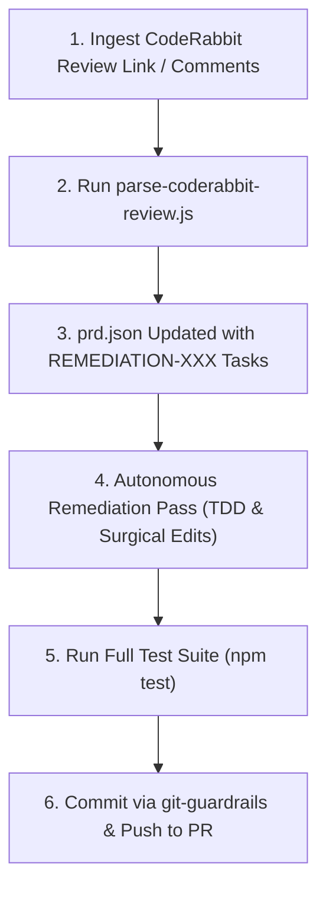

# /coderabbit-remediate: CodeRabbit Autonomous Remediation Pass

Automate review gates with CodeRabbit. When fixes are requested on a Pull Request, this skill parses the review comments, breaks them into atomic tasks in `prd.json`, and drives an autonomous remediation pass until all audit findings are resolved and verified.

## Remediation Workflow



---

## Step-by-Step Execution

### Step 1: Parse Review Comments into `prd.json`
When the user shares a CodeRabbit review link, PR URL, or pasted comments:
```bash
node .antigravity/scripts/parse-coderabbit-review.js --input "<url-or-text>" --prd prd.json
```
This classifies each finding by:
- **Category**: Cyclomatic Complexity, Security Vulnerability, Logic Bug.
- **Severity**: `[CRITICAL]`, `[WARNING]`, `[SUGGESTION]`.
- **Target Location**: `file:line`.
- **Acceptance Criteria**: Formulates automated pass/fail criteria.

### Step 2: Autonomous Remediation Pass
For each pending task in `prd.json`:

1. **Cyclomatic Complexity Findings**:
   - Locate the flagged function.
   - Decompose complex branching (`switch`, nested `if/else`, deep loops) into smaller, single-responsibility helper functions or strategy lookup tables.
   - Target cyclomatic complexity <= 10.
   
2. **Security Vulnerability Findings**:
   - Sanitize unvalidated inputs, escape shell arguments, replace dangerous regex expressions.
   - Author a test verifying that malicious inputs are safely rejected.

3. **Logic Bugs & Edge Cases**:
   - Author a failing test reproducing the exact edge case (null dereference, race condition, error state).
   - Apply minimal surgical fix.
   - Verify the test passes green.

### Step 3: Run Full Quality & Verification Suite
Run the project test suite to verify zero regressions:
```bash
npm test
```

### Step 4: Commit & Push to PR
Stage only the remediated files and commit with a Conventional Commit message:
```bash
git add <affected-files>
git commit -m "fix(review): remediate CodeRabbit audit findings"
git push origin <feature-branch>
```

CodeRabbit will automatically detect the new commit and re-audit the PR.
