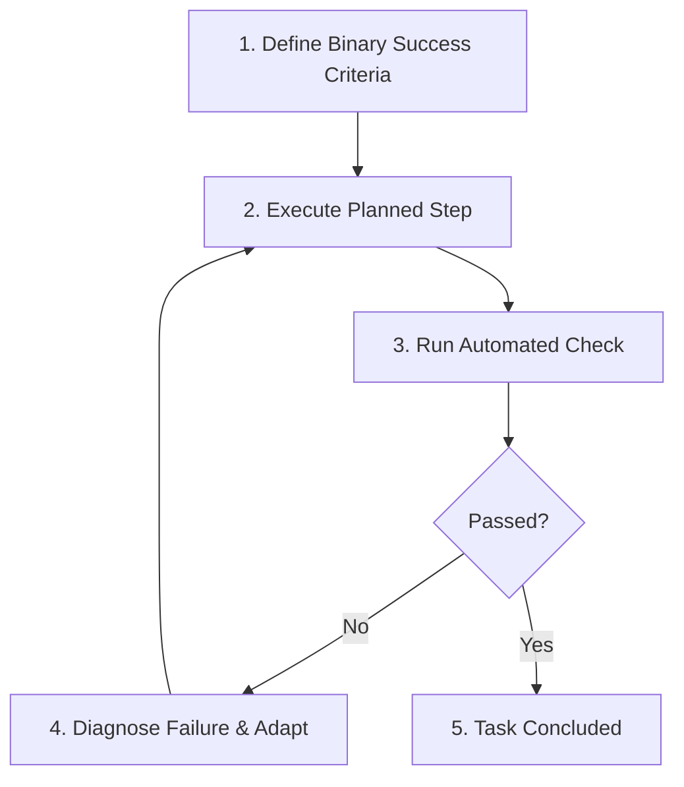

# /goal-driven-dev: Goal-Driven Execution & Verification Loops

Operationalizes **Rule 4: Goal-Driven Execution**. Guarantees that every task is transformed into verifiable goals and executed through autonomous verification loops.

## The Iron Law of Goal-Driven Development
> **Define success criteria before acting. Loop autonomously until verified. Strong success criteria enable independent execution.**

---

## The Verification Loop Runbook

### 1. Transform Tasks into Verifiable Criteria
- **"Add validation"** → *"Write test with 5 invalid inputs; all must return HTTP 400 with expected error codes."*
- **"Fix the bug"** → *"Write a reproducing test that fails on the bug; make it pass without regressing existing tests."*
- **"Refactor module"** → *"Run existing test suite before changes (100% green); make changes; verify suite remains 100% green."*

### 2. Formulate Multi-Step Verifiable Plan
Before making tool calls, state the verifiable plan:
1. `[Step 1]` → verify: `[automated test command or assertion]`
2. `[Step 2]` → verify: `[automated test command or assertion]`
3. `[Step 3]` → verify: `[automated test command or assertion]`

### 3. Loop Independently
- Execute the command or test.
- If the test fails, use the diagnostic output to fix the underlying issue immediately.
- Never stop and ask the user to verify something that an automated script or command can verify.
