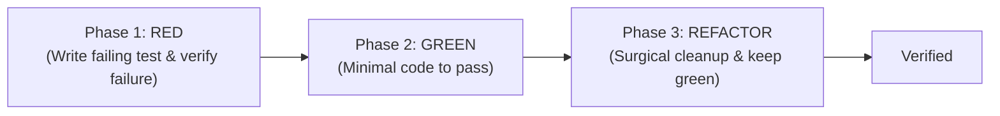

# /tdd: Red-Green-Refactor Enforcement

This skill enforces strict Test-Driven Development (TDD). It guarantees that no production code is authored without an automated test that first reproduces the issue or verifies the feature contract.

## The Iron Law of TDD
> **No production code may be authored unless it is directly preceded by a failing test that demonstrates the missing capability or reproducing bug.**

---

## The 3-Phase Execution Cycle



### Phase 1: RED (Write the Test First)
1. Identify the input/output contract from the interface specification or acceptance criteria.
2. Author an automated test file in the project's test directory (e.g. `tests/*.test.js` or `tests/*.test.ts`).
3. **MANDATORY EXECUTION**: Run the test runner immediately.
   ```bash
   npm test
   # or node tests/<test-file>.js
   ```
4. **VERIFY THE FAILURE**: Confirm that:
   - The test fails.
   - It fails **for the expected reason** (e.g. function undefined, assertion mismatch), NOT because of a syntax error or broken test runner setup.

### Phase 2: GREEN (Minimum Code to Pass)
1. Write the **minimum possible code** required to turn the failing test green.
   - Do NOT add speculative methods, configurability, or defensive abstractions.
   - Do NOT write more code than is needed to satisfy the test assertions.
2. Run the test runner again:
   ```bash
   npm test
   ```
3. Confirm that all tests now pass with exit code 0.

### Phase 3: REFACTOR (Surgical Clean-up)
1. Inspect the newly added code for:
   - Duplication.
   - Unused imports or variables.
   - Code readability or style alignment with the rest of the repository.
2. Make surgical edits.
3. Re-execute the test runner after every change to verify that the suite remains 100% green.

---

## Anti-Patterns & Violations to Avoid
* ❌ Writing the implementation first and adding tests afterward.
* ❌ Writing a test and immediately assuming it fails without executing it.
* ❌ Implementing speculative features or parameters not covered by the test assertions.
* ❌ Modifying existing unrelated tests without explicit justification.
