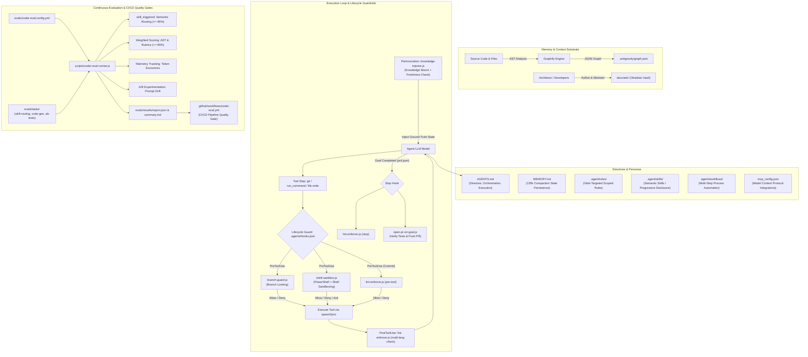

# Architecture Document: Canonical Antigravity Setup, Lifecycle Guardrails & Continuous Evaluation

## 1. High-Level Architecture Overview

The workspace implements an end-to-end, testable and observable agentic engineering system:
1. **Master Directive & Personas (`AGENTS.md`)**: Defines the Three-Layer Architecture (Directive, Orchestration, Execution) with specialized subagent personas (`architect`, `dev`, `devops`, `data_engineer`).
2. **Context Compaction Resilience (`MEMORY.md`)**: Dense, persistent state document that survives the 135,000-token automated context compaction threshold.
3. **Contextual Rules (`.agent/rules/`)**: Scoped rules targeted via YAML frontmatter `globs` arrays.
4. **Semantic Skills (`.agent/skills/`)**: Capabilities loaded via progressive disclosure with `SKILL.md` semantic frontmatter.
5. **Standard Multi-Step Workflows (`.agent/workflows/`)**: Standard operating procedures (`ci-remediate`, `security-audit`, `deploy-verify`).
6. **Model Context Protocol (`mcp_config.json`)**: Pre-configured server connections for GitHub, PostgreSQL, Firebase, Firecrawl, and framework orchestration.
7. **Antigravity Lifecycle Hooks (`.agents/hooks.json`)**: Real-time safety gating, branch locking, shell sandboxing, multi-language syntax checking, and goal-exhaustion PR dispatch.
8. **Memory Substrate**: Graphify AST topology (`.antigravity/graph.json`) and Obsidian Architecture Decision Records (`docs/adr/`).
9. **Continuous Evaluation Infrastructure (`coder-eval`)**: Declarative evaluation task suites (`evals/`), benchmark engine (`scripts/coder-eval-runner.js`), and GitHub Actions CI/CD quality gates (`.github/workflows/coder-eval.yml`).

---

## 2. Review Gate & Remediation Subsystem

1. **Auto-PR Dispatch (`open-pr-on-goal.js`)**:
   - Executes during the `Stop` event.
   - Inspects `prd.json` to verify all tasks are marked `done`.
   - Detects the default base branch dynamically (`main` vs `master`).
   - Runs `npm test` synchronously before asserting quality checkboxes.
   - Uses `spawnSync` with `{ shell: false }` to eliminate command injection.
2. **CodeRabbit Audit Engine (`.coderabbit.yaml` & `eslint.config.mjs`)**:
   - Audits cyclomatic complexity (> 10 threshold).
   - Scans for security vulnerabilities and injection flaws.
   - Executes ESLint static checks via flat `eslint.config.mjs`.
3. **Continuous Evaluation Pipeline (`coder-eval`)**:
   - Executes on every PR and weekly cron schedule.
   - Automatically catches silent regressions, prompt erosion, and skill routing failures before they reach production developers.
